# Complete Application Architecture

> Visual guide explaining every API endpoint, its internal functions, and how the entire system works.

---

## Table of Contents

1. [System Overview](#1-system-overview)
2. [Request Flow Through the System](#2-request-flow-through-the-system)
3. [API Gateway (Port 5000)](#3-api-gateway-port-5000)
4. [Product Service (Port 5001)](#4-product-service-port-5001)
5. [Product Detail Service (Port 5002)](#5-product-detail-service-port-5002)
6. [Cart Service (Port 5003)](#6-cart-service-port-5003)
7. [Order Orchestrator Service (Port 5004)](#7-order-orchestrator-service-port-5004)
8. [Notification Service (Port 5005)](#8-notification-service-port-5005)
9. [Shared Library Internals](#9-shared-library-internals)
10. [Complete API Reference](#10-complete-api-reference)
11. [Application Startup — What Executes First?](#11-application-startup--what-executes-first)

---

## 1. System Overview

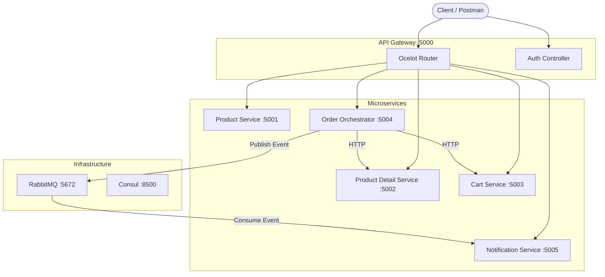

---

## 2. Request Flow Through the System

Every request passes through the same middleware pipeline before reaching the controller:

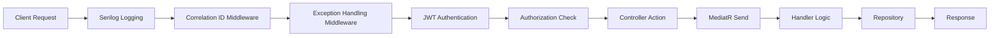

### What Each Middleware Does

| Step | Component | Purpose |
|------|-----------|---------|
| 1 | **Serilog** | Logs every request with timestamp, method, path |
| 2 | **Correlation ID** | Adds `X-Correlation-Id` header to track request across services |
| 3 | **Exception Handling** | Catches errors and returns clean JSON error responses |
| 4 | **JWT Auth** | Validates Bearer token (HS256, 2hr expiry) |
| 5 | **Authorization** | Checks role: `AdminOnly` or `UserOrAdmin` policy |
| 6 | **Controller** | Receives request, creates MediatR command/query |
| 7 | **MediatR** | Routes command/query to correct handler (CQRS pattern) |
| 8 | **Handler** | Contains business logic, calls repository |
| 9 | **Repository** | In-memory data store (ConcurrentDictionary) |

---

## 3. API Gateway (Port 5000)

The single entry point for all client requests.

### Architecture

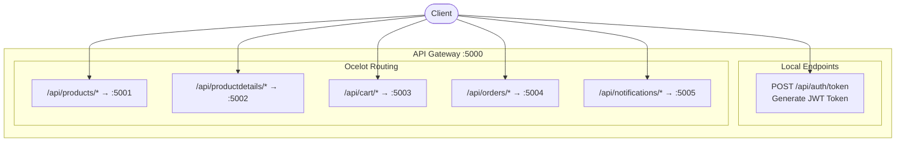

### API: POST /api/auth/token

Generates a JWT token for authentication.

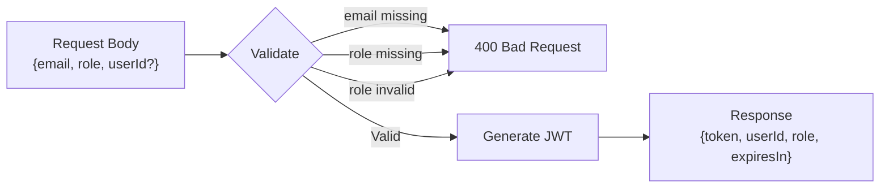

**Internal Steps:**
1. Validate `email` is not empty
2. Validate `role` is not empty
3. Validate `role` is either `"Admin"` or `"User"`
4. If `userId` not provided, generate new GUID
5. Call `JwtHelper.GenerateToken(userId, role, email)`
6. JWT includes claims: NameIdentifier, Role, Email, Jti
7. Token expires in 2 hours, signed with HS256

### Ocelot Route Table

| Client Calls | Routes To | Methods |
|-------------|-----------|---------|
| `/api/products` | product-service:5001 | GET, POST |
| `/api/products/{anything}` | product-service:5001 | GET, POST, PUT, DELETE |
| `/api/productdetails` | product-detail_service:5002 | GET, POST |
| `/api/productdetails/{anything}` | product-detail_service:5002 | GET, POST, PUT, DELETE |
| `/api/cart/{anything}` | cart.service:5003 | GET, POST, PUT, DELETE |
| `/api/orders/{anything}` | order-orchestrator-service:5004 | GET, POST, PUT, DELETE |
| `/api/notifications/{anything}` | notification-service:5005 | GET |

---

## 4. Product Service (Port 5001)

Manages the product catalog. Admin creates products, users browse them.

### Architecture

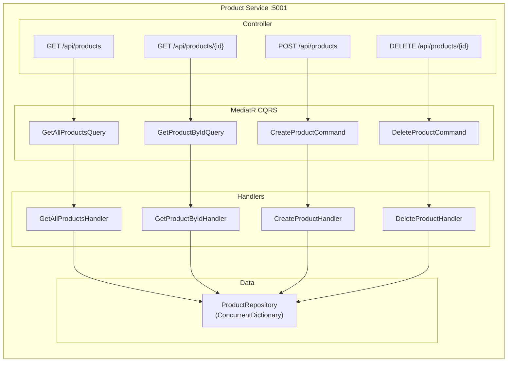

### API Details

#### GET /api/products — List All Products (Paginated)

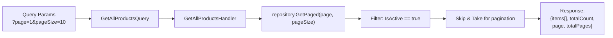

- **Auth:** None (public)
- **Handler Logic:** Fetches only active products, applies Skip/Take pagination
- **Repository Method:** `GetPaged(page, pageSize)` + `GetTotalCount()`

#### GET /api/products/{id} — Get Single Product

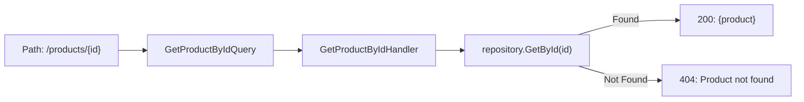

- **Auth:** None (public)
- **Handler Logic:** Direct lookup by GUID

#### POST /api/products — Create Product

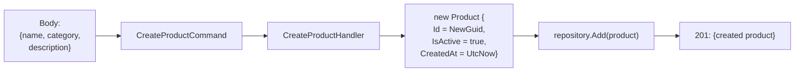

- **Auth:** AdminOnly
- **Handler Logic:** Creates new Product with auto-generated Id, sets IsActive=true, CreatedAt=UtcNow

#### DELETE /api/products/{id} — Delete Product (Soft Delete)

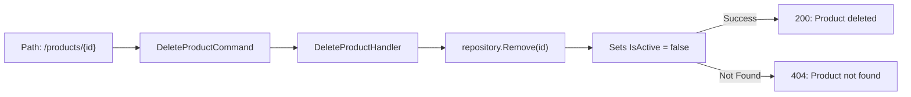

- **Auth:** AdminOnly
- **Handler Logic:** Soft delete — sets `IsActive = false`, product stays in memory

### Seed Data (Pre-loaded)

| Product | Category |
|---------|----------|
| Classic T-Shirt | Clothing |
| Running Shoes | Footwear |
| Laptop Backpack | Accessories |

---

## 5. Product Detail Service (Port 5002)

Manages product variants — different sizes, colors, prices, and stock for each product.

### Architecture

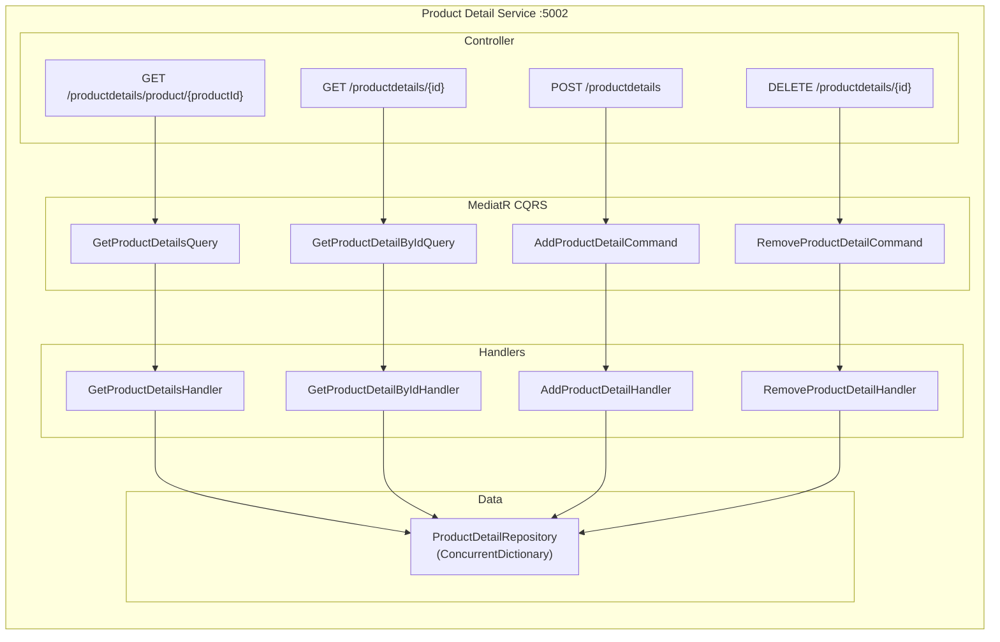

### API Details

#### GET /api/productdetails/product/{productId} — Get All Variants for a Product

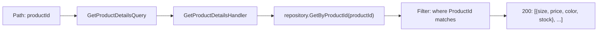

- **Auth:** None (public)
- **Handler Logic:** Filters all details where `ProductId == productId`

#### GET /api/productdetails/{id} — Get Single Variant

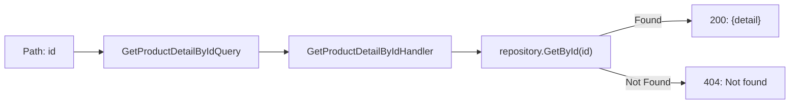

- **Auth:** None (public)

#### POST /api/productdetails — Add Product Variant

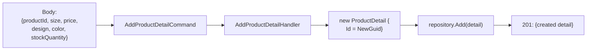

- **Auth:** AdminOnly
- **Handler Logic:** Creates variant linked to a product via `ProductId`

#### DELETE /api/productdetails/{id} — Remove Variant

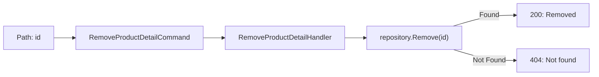

- **Auth:** AdminOnly
- **Handler Logic:** Hard delete — removes from dictionary entirely

### Seed Data

| Size | Color | Price | Stock | Design |
|------|-------|-------|-------|--------|
| M | Blue | $29.99 | 100 | Crew Neck |
| L | Red | $31.99 | 50 | Crew Neck |

---

## 6. Cart Service (Port 5003)

Manages shopping carts — one cart per user. Supports add, remove, view, and clear.

### Architecture

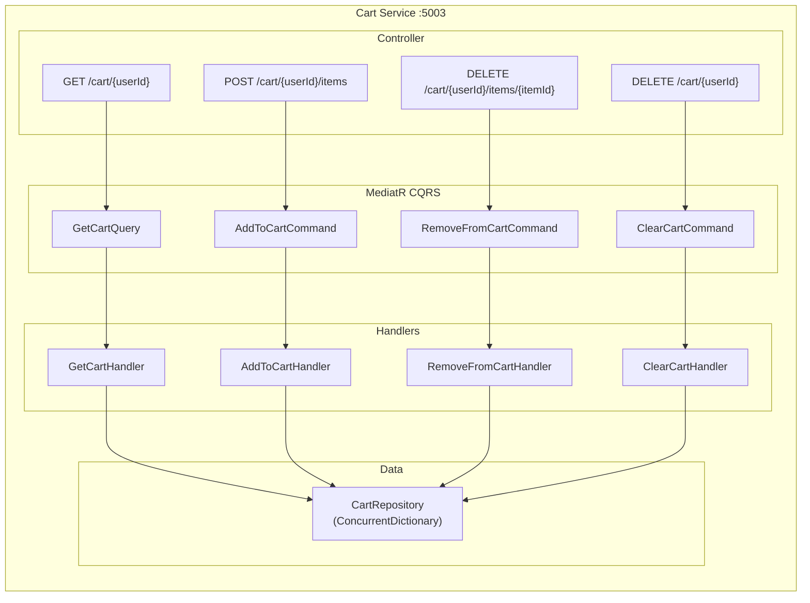

### API Details

#### GET /api/cart/{userId} — View Cart

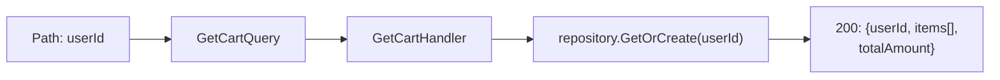

- **Auth:** UserOrAdmin
- **Handler Logic:** Returns existing cart or creates empty one. `TotalAmount` is calculated as sum of `Price × Quantity` for all items.

#### POST /api/cart/{userId}/items — Add Item to Cart

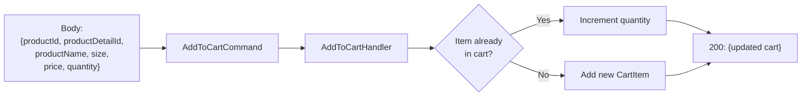

- **Auth:** UserOrAdmin
- **Handler Logic:** 
  - Checks if item with same `ProductId + ProductDetailId` exists
  - If yes: increments `Quantity` on existing item
  - If no: creates new `CartItem` with auto-generated Id
  - Returns full updated cart

#### DELETE /api/cart/{userId}/items/{itemId} — Remove Item

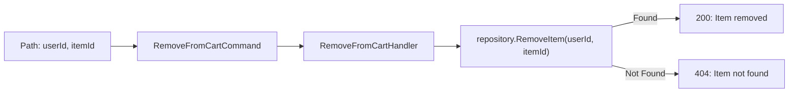

- **Auth:** UserOrAdmin

#### DELETE /api/cart/{userId} — Clear Entire Cart

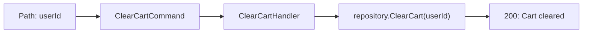

- **Auth:** UserOrAdmin
- **Handler Logic:** Removes all items from the cart. Always succeeds.

---

## 7. Order Orchestrator Service (Port 5004)

The most complex service. Orchestrates checkout across multiple services using the **Saga pattern**.

### Architecture

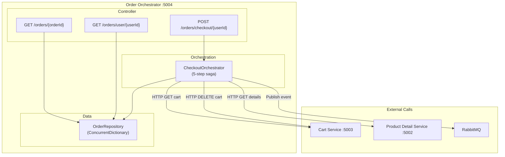

### API Details

#### POST /api/orders/checkout/{userId} — Checkout (The Main Orchestrated Flow)

This is the most important API. It runs 5 steps in sequence:

```mermaid
graph TB
    START["POST /orders/checkout/{userId}"] --> S1

    subgraph "Step 1: Fetch Cart"
        S1["HTTP GET → cart-service:5003<br/>/api/cart/{userId}"]
        S1 --> S1C{Cart empty?}
        S1C -->|Yes| FAIL1["FAIL: Cart is empty"]
        S1C -->|No| S2
    end

    subgraph "Step 2: Validate Items"
        S2["For EACH cart item:<br/>HTTP GET → product-detail-service:5002<br/>/api/productdetails/{detailId}"]
        S2 --> S2C{All items exist?}
        S2C -->|No| FAIL2["Publish OrderFailedEvent<br/>FAIL: Item unavailable"]
        S2C -->|Yes| S3
    end

    subgraph "Step 3: Create Order"
        S3["Map CartItems → OrderItems<br/>Create Order<br/>Status = Confirmed<br/>Save to repository"]
        S3 --> S4
    end

    subgraph "Step 4: Clear Cart"
        S4["HTTP DELETE → cart-service:5003<br/>/api/cart/{userId}"]
        S4 --> S5
    end

    subgraph "Step 5: Publish Event"
        S5["Publish OrderCreatedEvent<br/>→ RabbitMQ<br/>exchange: ecommerce.events<br/>routing: order.created"]
        S5 --> SUCCESS["200: {order with items}"]
    end
```

- **Auth:** UserOrAdmin
- **Orchestrator Internal Functions:**

| Function | What It Does |
|----------|-------------|
| `ExecuteCheckout(userId)` | Runs all 5 steps in sequence. Main entry point. |
| `GetCart(userId)` | HTTP GET to Cart Service. Deserializes `ApiResponse<Cart>`. Returns cart or null. |
| `ValidateProductDetail(detailId)` | HTTP GET to Product Detail Service. Returns true if status 200. |
| `ClearCart(userId)` | HTTP DELETE to Cart Service. Logs failure but doesn't abort checkout. |
| `PublishOrderCreated(order)` | Serializes `OrderCreatedEvent`, publishes to RabbitMQ exchange. |
| `PublishOrderFailed(userId, orderId, reason)` | Serializes `OrderFailedEvent`, publishes to RabbitMQ. |

#### Failure Scenario

```mermaid
graph LR
    A["Checkout starts"] --> B["Get Cart → OK"]
    B --> C["Validate Item → NOT FOUND"]
    C --> D["Publish OrderFailedEvent"]
    D --> E["Return 404 Error"]
    E --> F["Cart is NOT cleared<br/>User can retry"]
```

#### GET /api/orders/{orderId} — Get Single Order

```mermaid
graph LR
    A["Path: orderId"] --> B["repository.GetById(orderId)"]
    B -->|Found| C["200: {order}"]
    B -->|Not Found| D["404: Order not found"]
```

- **Auth:** UserOrAdmin

#### GET /api/orders/user/{userId} — Get User's Orders

```mermaid
graph LR
    A["Path: userId"] --> B["repository.GetByUserId(userId)"]
    B --> C["Sort by CreatedAt descending"]
    C --> D["200: [{order1}, {order2}, ...]"]
```

- **Auth:** UserOrAdmin

---

## 8. Notification Service (Port 5005)

Consumes events from RabbitMQ in the background. No business API endpoints.

### Architecture

```mermaid
graph TB
    subgraph "Notification Service :5005"
        direction TB
        subgraph "Background Service"
            BG["NotificationConsumerService<br/>(BackgroundService)"]
        end

        subgraph "Controller"
            E1["GET /health"]
        end

        subgraph "RabbitMQ Subscriptions"
            SUB1["Queue: notification.order.created<br/>Routing Key: order.created"]
            SUB2["Queue: notification.order.failed<br/>Routing Key: order.failed"]
        end
    end

    RMQ[RabbitMQ] -->|OrderCreatedEvent| SUB1
    RMQ -->|OrderFailedEvent| SUB2
    SUB1 --> BG
    SUB2 --> BG
    BG --> LOG["Console Log:<br/>Order Created / Failed"]
```

### How the Background Service Works

```mermaid
graph TB
    A["Service Starts"] --> B["Connect to RabbitMQ<br/>(retry up to 10 times,<br/>5s between retries)"]
    B --> C["Subscribe to order.created"]
    C --> D["Subscribe to order.failed"]
    D --> E["Keep running forever<br/>(1s delay loop)"]

    F["OrderCreatedEvent arrives"] --> G["Deserialize JSON"]
    G --> H["Log: Order Created!<br/>OrderId, Total, Items, Time"]

    I["OrderFailedEvent arrives"] --> J["Deserialize JSON"]
    J --> K["Log: Order Failed!<br/>OrderId, Reason, Time"]
```

### API: GET /health

```mermaid
graph LR
    A["GET /health"] --> B["200: {status: Healthy,<br/>service: NotificationService,<br/>timestamp: now}"]
```

Simple health check endpoint. No auth required.

---

## 9. Shared Library Internals

The Shared library is referenced by all 6 services. It provides common building blocks.

### Components Overview

```mermaid
graph TB
    subgraph "Shared Library"
        direction TB
        subgraph "Middleware"
            MW1["CorrelationIdMiddleware"]
            MW2["ExceptionHandlingMiddleware"]
        end

        subgraph "Auth"
            A1["JwtHelper"]
            A2["ServiceExtensions"]
        end

        subgraph "Models"
            M1["Product"]
            M2["ProductDetail"]
            M3["Cart / CartItem"]
            M4["Order / OrderItem"]
            M5["ApiResponse"]
        end

        subgraph "Events"
            EV1["OrderCreatedEvent"]
            EV2["OrderFailedEvent"]
            EV3["ProductAddedEvent"]
        end

        subgraph "Messaging"
            MSG1["RabbitMqPublisher"]
            MSG2["RabbitMqConsumer"]
        end
    end
```

### Correlation ID Middleware

```mermaid
graph LR
    A["Incoming Request"] --> B{"Has X-Correlation-Id<br/>header?"}
    B -->|Yes| C["Use existing ID"]
    B -->|No| D["Generate new GUID"]
    C --> E["Store in HttpContext.Items"]
    D --> E
    E --> F["Add to Response Headers"]
    F --> G["Create Log Scope"]
    G --> H["Continue Pipeline"]
```

Tracks a single request across all microservices. If Service A calls Service B, both log the same Correlation ID.

### Exception Handling Middleware

```mermaid
graph LR
    A["Request enters"] --> B["try: call next()"]
    B -->|No error| C["Normal response"]
    B -->|KeyNotFoundException| D["404 Not Found"]
    B -->|ArgumentException| E["400 Bad Request"]
    B -->|UnauthorizedAccessException| F["401 Unauthorized"]
    B -->|Any other error| G["500 Internal Error"]
    D --> H["JSON Problem Details response"]
    E --> H
    F --> H
    G --> H
```

### JWT Authentication Flow

```mermaid
graph LR
    A["Request with<br/>Authorization: Bearer {token}"] --> B["Validate Token"]
    B --> C{"Valid?"}
    C -->|No| D["401 Unauthorized"]
    C -->|Yes| E["Extract Claims:<br/>UserId, Role, Email"]
    E --> F{"Meets policy?"}
    F -->|AdminOnly + role=Admin| G["Allow"]
    F -->|UserOrAdmin + role=User or Admin| G
    F -->|Doesn't match| H["403 Forbidden"]
```

### RabbitMQ Messaging

```mermaid
graph LR
    subgraph "Publisher (Order Service)"
        P1["Serialize event to JSON"]
        P2["Declare exchange:<br/>ecommerce.events (topic)"]
        P3["Publish with routing key"]
    end

    subgraph "RabbitMQ"
        EX["Exchange:<br/>ecommerce.events"]
        Q1["Queue:<br/>notification.order.created"]
        Q2["Queue:<br/>notification.order.failed"]
    end

    subgraph "Consumer (Notification Service)"
        C1["Bind queue to exchange"]
        C2["Receive message"]
        C3["Deserialize JSON"]
        C4["Call handler function"]
        C5["ACK message"]
    end

    P1 --> P2 --> P3 --> EX
    EX -->|"routing: order.created"| Q1
    EX -->|"routing: order.failed"| Q2
    Q1 --> C1 --> C2 --> C3 --> C4 --> C5
```

---

## 10. Complete API Reference

### All Endpoints at a Glance

| # | Method | Endpoint | Service | Auth | Purpose |
|---|--------|----------|---------|------|---------|
| 1 | POST | `/api/auth/token` | Gateway | None | Generate JWT token |
| 2 | GET | `/api/products` | Product | None | List all products (paginated) |
| 3 | GET | `/api/products/{id}` | Product | None | Get single product |
| 4 | POST | `/api/products` | Product | Admin | Create product |
| 5 | DELETE | `/api/products/{id}` | Product | Admin | Soft-delete product |
| 6 | GET | `/api/productdetails/product/{productId}` | ProductDetail | None | Get all variants for product |
| 7 | GET | `/api/productdetails/{id}` | ProductDetail | None | Get single variant |
| 8 | POST | `/api/productdetails` | ProductDetail | Admin | Add product variant |
| 9 | DELETE | `/api/productdetails/{id}` | ProductDetail | Admin | Remove variant |
| 10 | GET | `/api/cart/{userId}` | Cart | UserOrAdmin | View cart |
| 11 | POST | `/api/cart/{userId}/items` | Cart | UserOrAdmin | Add item to cart |
| 12 | DELETE | `/api/cart/{userId}/items/{itemId}` | Cart | UserOrAdmin | Remove item from cart |
| 13 | DELETE | `/api/cart/{userId}` | Cart | UserOrAdmin | Clear entire cart |
| 14 | POST | `/api/orders/checkout/{userId}` | OrderOrchestrator | UserOrAdmin | Checkout (5-step saga) |
| 15 | GET | `/api/orders/{orderId}` | OrderOrchestrator | UserOrAdmin | Get order by ID |
| 16 | GET | `/api/orders/user/{userId}` | OrderOrchestrator | UserOrAdmin | Get all user orders |
| 17 | GET | `/health` | Notification | None | Health check |

### Request / Response Body Reference

#### Token Request (POST /api/auth/token)
```json
{
  "email": "admin@example.com",
  "role": "Admin",
  "userId": "optional-guid"
}
```

#### Token Response
```json
{
  "token": "eyJhbG...",
  "userId": "guid",
  "role": "Admin",
  "expiresIn": "2 hours"
}
```

#### Create Product (POST /api/products)
```json
{
  "name": "Classic T-Shirt",
  "category": "Clothing",
  "description": "Comfortable cotton t-shirt"
}
```

#### Add Product Detail (POST /api/productdetails)
```json
{
  "productId": "guid-from-product",
  "size": "M",
  "price": 29.99,
  "design": "Crew Neck",
  "color": "Blue",
  "stockQuantity": 100
}
```

#### Add to Cart (POST /api/cart/{userId}/items)
```json
{
  "productId": "guid",
  "productDetailId": "guid",
  "productName": "Classic T-Shirt",
  "size": "M",
  "price": 29.99,
  "quantity": 2
}
```

#### Standard Success Response (all endpoints)
```json
{
  "success": true,
  "message": "Success",
  "data": { },
  "errors": []
}
```

#### Standard Error Response
```json
{
  "success": false,
  "message": "Product not found",
  "data": null,
  "errors": ["Product with id xyz not found"]
}
```

### CQRS Pattern Used In Each Service

```mermaid
graph TB
    subgraph "CQRS Pattern"
        direction LR
        subgraph "Command Side (Write)"
            CMD["Command Record<br/>(data to change)"]
            CMD --> CH["Command Handler<br/>(business logic)"]
            CH --> REPO1["Repository.Add()<br/>Repository.Remove()"]
        end

        subgraph "Query Side (Read)"
            QRY["Query Record<br/>(what to fetch)"]
            QRY --> QH["Query Handler<br/>(fetch logic)"]
            QH --> REPO2["Repository.Get()<br/>Repository.GetAll()"]
        end
    end
```

| Service | Commands (Write) | Queries (Read) |
|---------|-----------------|----------------|
| Product | CreateProduct, DeleteProduct | GetAllProducts, GetProductById |
| ProductDetail | AddProductDetail, RemoveProductDetail | GetProductDetails, GetProductDetailById |
| Cart | AddToCart, RemoveFromCart, ClearCart | GetCart |
| OrderOrchestrator | *(uses Orchestrator instead of MediatR)* | GetOrder, GetUserOrders |

### Data Models

```mermaid
graph LR
    subgraph "Product Domain"
        P["Product<br/>id, name, category,<br/>description, isActive"]
        PD["ProductDetail<br/>id, productId, size,<br/>price, design, color, stock"]
        P -->|"1 : many"| PD
    end

    subgraph "Cart Domain"
        C["Cart<br/>userId, totalAmount"]
        CI["CartItem<br/>id, productId, detailId,<br/>name, size, price, qty"]
        C -->|"1 : many"| CI
    end

    subgraph "Order Domain"
        O["Order<br/>id, userId, total,<br/>status, createdAt"]
        OI["OrderItem<br/>productId, detailId,<br/>name, size, price, qty"]
        O -->|"1 : many"| OI
    end

    CI -.->|"checkout copies to"| OI
```

### Order Status Flow

```mermaid
graph LR
    A["Pending"] --> B["Confirmed"]
    A --> C["Failed"]
    B --> D["Cancelled"]
```

| Status | When |
|--------|------|
| Pending | Default when order is first created |
| Confirmed | All 5 checkout steps succeed |
| Failed | Product detail validation fails |
| Cancelled | Manual cancellation (future feature) |

---

## 11. Application Startup — What Executes First?

This section explains what happens when you run `docker compose up --build` or `dotnet run`. For Docker Compose, note that `depends_on` mainly affects container start order; it does **not** mean a service is fully ready unless a health-based condition is configured.

---

### 11.1 Docker Compose Startup Order

When you run `docker compose up --build`, Docker Compose first builds images, then starts containers. Some containers may start in parallel, and only a few services have explicit startup dependencies:

```mermaid
graph TD
    A["docker compose up --build"] --> B["Step 1: Build all Docker images<br/>(multi-stage: restore → build → publish)"]
    B --> C["Step 2: Docker Compose starts containers"]

    C --> RMQ["RabbitMQ :5672<br/>Starts and runs healthcheck"]
    C --> CONSUL["Consul :8500<br/>Started by Compose"]
    C --> PS["Product Service :5001<br/>No depends_on"]
    C --> PDS["Product Detail Service :5002<br/>No depends_on"]
    C --> CS["Cart Service :5003<br/>No depends_on"]

    RMQ -->|"healthcheck passes"| OO["Order Orchestrator :5004<br/>waits for RabbitMQ health"]
    RMQ -->|"healthcheck passes"| NS["Notification Service :5005<br/>waits for RabbitMQ health"]

    PS --> GWSTART["API Gateway can be started after listed dependencies are started"]
    PDS --> GWSTART
    CS --> GWSTART
    OO --> GWSTART
    NS --> GWSTART

    GWSTART --> GW["API Gateway :5000<br/>depends_on affects start order only,<br/>not readiness of all 5 services"]

    GW --> G["Containers started; individual services may still be initializing"]
```

| Order | Container | Why This Order? |
|-------|-----------|----------------|
| 1st | RabbitMQ | Infrastructure — other services depend on it |
| 1st | Consul | Infrastructure — starts independently |
| 2nd | Product Service | No dependencies — starts immediately |
| 2nd | Product Detail Service | No dependencies — starts immediately |
| 2nd | Cart Service | No dependencies — starts immediately |
| 3rd | Order Orchestrator | Waits for RabbitMQ healthcheck to pass |
| 3rd | Notification Service | Waits for RabbitMQ healthcheck to pass |
| 4th | API Gateway | Waits for all 5 microservices to start |

---

### 11.2 What Happens Inside Each Service on Startup (Program.cs)

Every .NET service follows a two-phase startup: **Build Phase** (register services) then **Run Phase** (configure pipeline).

```mermaid
graph TB
    A["dotnet run / Container starts"] --> B["Phase 1: BUILD<br/>WebApplication.CreateBuilder(args)"]
    B --> B1["Configure Serilog Logger"]
    B1 --> B2["Register Services into DI Container"]
    B2 --> B3["builder.Build() → creates WebApplication"]
    B3 --> C["Phase 2: RUN<br/>Configure HTTP Pipeline"]
    C --> C1["Add Middleware (in order)"]
    C1 --> C2["Map Controller Routes"]
    C2 --> C3["app.Run() → Start Listening for HTTP Requests"]
```

---

### 11.3 API Gateway — Startup Sequence

```mermaid
graph TB
    subgraph "Phase 1: Build (Service Registration)"
        A1["1. Create WebApplicationBuilder"]
        A2["2. Configure Serilog<br/>Console logger with CorrelationId template"]
        A3["3. Load ocelot.json config file"]
        A4["4. Register Controllers (AuthController)"]
        A5["5. Register Swagger (API docs)"]
        A6["6. Register Ocelot routing engine"]
        A7["7. builder.Build()"]
        A1 --> A2 --> A3 --> A4 --> A5 --> A6 --> A7
    end

    subgraph "Phase 2: Run (HTTP Pipeline)"
        B1["8. UseRouting()"]
        B2["9. UseSwagger + SwaggerUI"]
        B3["10. CorrelationIdMiddleware<br/>(adds X-Correlation-Id header)"]
        B4["11. ExceptionHandlingMiddleware<br/>(catches errors → JSON responses)"]
        B5["12. MapControllers()<br/>(AuthController handles /api/auth/*)"]
        B6["13. UseOcelot()<br/>(proxy unmatched requests to services)"]
        B7["14. app.Run()<br/>Listening on port 5000"]
        B1 --> B2 --> B3 --> B4 --> B5 --> B6 --> B7
    end
```

**Key Point:** `MapControllers()` runs BEFORE `UseOcelot()`. This means:
- `/api/auth/token` → handled by local AuthController
- `/api/products/*` → Ocelot proxies to Product Service
- Any unmatched route → Ocelot tries to route it

---

### 11.4 Product / ProductDetail / Cart Service — Startup Sequence

All three follow the same pattern:

```mermaid
graph TB
    subgraph "Phase 1: Build (Service Registration)"
        A1["1. Create WebApplicationBuilder"]
        A2["2. Configure Serilog<br/>Console logger with CorrelationId"]
        A3["3. AddControllers()"]
        A4["4. AddSwaggerGen()"]
        A5["5. AddMediatR()<br/>Scan assembly for all<br/>Command/Query Handlers"]
        A6["6. AddSingleton Repository<br/>(ConcurrentDictionary with seed data)"]
        A7["7. AddJwtAuthentication()<br/>→ JWT Bearer validation<br/>→ AdminOnly policy<br/>→ UserOrAdmin policy"]
        A8["8. builder.Build()"]
        A1 --> A2 --> A3 --> A4 --> A5 --> A6 --> A7 --> A8
    end

    subgraph "Phase 2: Run (HTTP Pipeline)"
        B1["9. UseSwagger + SwaggerUI"]
        B2["10. CorrelationIdMiddleware"]
        B3["11. ExceptionHandlingMiddleware"]
        B4["12. UseAuthentication()<br/>(validates JWT token)"]
        B5["13. UseAuthorization()<br/>(checks Admin/User role)"]
        B6["14. MapControllers()"]
        B7["15. app.Run()<br/>Listening on port 5001/5002/5003"]
        B1 --> B2 --> B3 --> B4 --> B5 --> B6 --> B7
    end
```

**What happens at Step 5 (MediatR scan):**

```mermaid
graph LR
    MR["AddMediatR scans assembly"] --> F1["Finds GetAllProductsHandler"]
    MR --> F2["Finds GetProductByIdHandler"]
    MR --> F3["Finds CreateProductHandler"]
    MR --> F4["Finds DeleteProductHandler"]
    F1 --> REG["All handlers registered in DI<br/>Ready to receive commands/queries"]
    F2 --> REG
    F3 --> REG
    F4 --> REG
```

**What happens at Step 6 (Repository registration):**

```mermaid
graph LR
    R["AddSingleton ProductRepository"] --> DI["Repository registered in DI<br/>with singleton lifetime"]
    DI --> L["Instance created lazily<br/>when first resolved (default ASP.NET Core DI behavior)"]
    L --> C["Constructor runs"]
    C --> S["ConcurrentDictionary created"]
    S --> D["Seed data loaded:<br/>3 products / 2 details / empty carts"]
```

**What happens at Step 7 (JWT setup):**

```mermaid
graph LR
    J["AddJwtAuthentication()"] --> A["Register JWT Bearer scheme<br/>HS256, Issuer, Audience"]
    A --> P1["Create AdminOnly policy<br/>(requires Role = Admin)"]
    P1 --> P2["Create UserOrAdmin policy<br/>(requires Role = User or Admin)"]
```

---

### 11.5 Order Orchestrator — Startup Sequence

This service has extra setup for HTTP clients and RabbitMQ.

```mermaid
graph TB
    subgraph "Phase 1: Build (Service Registration)"
        A1["1. Create WebApplicationBuilder"]
        A2["2. Configure Serilog"]
        A3["3. AddControllers + Swagger"]
        A4["4. AddMediatR (scan handlers)"]
        A5["5. AddSingleton OrderRepository"]
        A6["6. AddJwtAuthentication()"]
        A7["7. AddHttpClient 'CartService'<br/>BaseAddress: http://cart.service:5003<br/>Configurable via ServiceUrls:CartService"]
        A8["8. AddHttpClient 'ProductDetailService'<br/>BaseAddress: http://product-detail_service:5002<br/>Configurable via ServiceUrls:ProductDetailService"]
        A9["9. Create RabbitMqPublisher<br/>→ Connect to rabbitmq:5672<br/>→ Open channel<br/>→ Register as Singleton"]
        A10["10. AddScoped CheckoutOrchestrator"]
        A11["11. builder.Build()"]
        A1 --> A2 --> A3 --> A4 --> A5 --> A6 --> A7 --> A8 --> A9 --> A10 --> A11
    end

    subgraph "Phase 2: Run (HTTP Pipeline)"
        B1["12. UseSwagger + SwaggerUI"]
        B2["13. CorrelationIdMiddleware"]
        B3["14. ExceptionHandlingMiddleware"]
        B4["15. UseAuthentication"]
        B5["16. UseAuthorization"]
        B6["17. MapControllers"]
        B7["18. app.Run()<br/>Listening on port 5004"]
        B1 --> B2 --> B3 --> B4 --> B5 --> B6 --> B7
    end
```

**What happens at Step 9 (RabbitMQ connection):**

```mermaid
graph LR
    A["RabbitMqPublisher.CreateAsync()"] --> B["Create ConnectionFactory<br/>HostName = rabbitmq"]
    B --> C["CreateConnectionAsync()"]
    C --> D["CreateChannelAsync()"]
    D --> E["Publisher ready<br/>Can publish to exchanges"]
```

**What happens at Step 10 (CheckoutOrchestrator registered as Scoped):**

```mermaid
graph LR
    A["AddScoped means:"] --> B["New instance per HTTP request"]
    B --> C["Injected with:<br/>OrderRepository<br/>IHttpClientFactory<br/>IMessagePublisher<br/>ILogger"]
```

---

### 11.6 Notification Service — Startup Sequence

This service is unique — it has a **BackgroundService** that starts automatically.

```mermaid
graph TB
    subgraph "Phase 1: Build (Service Registration)"
        A1["1. Create WebApplicationBuilder"]
        A2["2. Configure Serilog"]
        A3["3. AddControllers + Swagger"]
        A4["4. AddHostedService<br/>NotificationConsumerService"]
        A5["5. builder.Build()"]
        A1 --> A2 --> A3 --> A4 --> A5
    end

    subgraph "Phase 2: Run (HTTP Pipeline + Background)"
        B1["6. UseSwagger + SwaggerUI"]
        B2["7. CorrelationIdMiddleware"]
        B3["8. ExceptionHandlingMiddleware"]
        B4["9. MapControllers (health endpoint)"]
        B5["10. app.Run()"]
        B1 --> B2 --> B3 --> B4 --> B5
    end

    B5 --> C["Two things run simultaneously:"]
    C --> D["Kestrel Web Server<br/>Listens on port 5005<br/>(handles /health endpoint)"]
    C --> E["BackgroundService: ExecuteAsync()"]

    subgraph "BackgroundService Startup"
        E --> E1["11. Try connecting to RabbitMQ"]
        E1 --> E2{"Connected?"}
        E2 -->|"No"| E3["Wait 5 seconds, retry<br/>(up to 10 attempts)"]
        E3 --> E1
        E2 -->|"Yes"| E4["12. RabbitMqConsumer.CreateAsync()"]
        E4 --> E5["13. Subscribe to order.created<br/>Queue: notification.order.created"]
        E5 --> E6["14. Subscribe to order.failed<br/>Queue: notification.order.failed"]
        E6 --> E7["15. Enter keep-alive loop<br/>(1s delay, waiting for events)"]
    end
```

**What happens when an event arrives:**

```mermaid
graph LR
    A["RabbitMQ delivers message"] --> B["Consumer receives bytes"]
    B --> C["Deserialize JSON<br/>to OrderCreatedEvent<br/>or OrderFailedEvent"]
    C --> D["Call handler function"]
    D --> E["Log formatted notification<br/>to console"]
    E --> F["ACK message<br/>(tell RabbitMQ: done)"]
```

---

### 11.7 Complete Startup Timeline

Here is the full timeline of what happens from `docker compose up` to "system ready":

```mermaid
sequenceDiagram
    participant DC as docker compose
    participant RMQ as RabbitMQ
    participant CON as Consul
    participant PS as Product Service
    participant PDS as ProductDetail Service
    participant CS as Cart Service
    participant OO as Order Orchestrator
    participant NS as Notification Service
    participant GW as API Gateway

    DC->>RMQ: Start container
    DC->>CON: Start container
    RMQ->>RMQ: Initialize broker
    RMQ->>RMQ: Healthcheck ping (every 10s)

    DC->>PS: Start container
    PS->>PS: Serilog setup
    PS->>PS: Register MediatR (scan 4 handlers)
    PS->>PS: Create ProductRepository (3 seed products)
    PS->>PS: Setup JWT auth + policies
    PS->>PS: Build middleware pipeline
    PS->>PS: Listening on :5001

    DC->>PDS: Start container
    PDS->>PDS: Same setup as Product Service
    PDS->>PDS: Create ProductDetailRepository (2 seed items)
    PDS->>PDS: Listening on :5002

    DC->>CS: Start container
    CS->>CS: Same setup as Product Service
    CS->>CS: Create CartRepository (empty)
    CS->>CS: Listening on :5003

    Note over RMQ: Healthcheck passes!

    DC->>OO: Start container
    OO->>OO: Serilog + MediatR + JWT setup
    OO->>OO: Create OrderRepository (empty)
    OO->>OO: Register HttpClient for CartService
    OO->>OO: Register HttpClient for ProductDetailService
    OO->>RMQ: Connect RabbitMqPublisher
    RMQ-->>OO: Connection established
    OO->>OO: Register CheckoutOrchestrator
    OO->>OO: Listening on :5004

    DC->>NS: Start container
    NS->>NS: Serilog setup
    NS->>NS: Register NotificationConsumerService
    NS->>NS: Build pipeline + start Kestrel on :5005
    NS->>NS: BackgroundService.ExecuteAsync() begins
    NS->>RMQ: Try connect (attempt 1)
    RMQ-->>NS: Connected!
    NS->>RMQ: Subscribe to order.created queue
    NS->>RMQ: Subscribe to order.failed queue
    NS->>NS: Listening for events...

    DC->>GW: Start container
    GW->>GW: Serilog setup
    GW->>GW: Load ocelot.json (7 routes)
    GW->>GW: Register Ocelot engine
    GW->>GW: Build pipeline
    GW->>GW: Listening on :5000

    Note over DC,GW: ALL SERVICES READY!
```

---

### 11.8 What Happens When You Hit an API

After startup, here's what executes when a request comes in:

#### Example: POST /api/products (Create a product)

```mermaid
graph TB
    A["Client sends POST /api/products<br/>Header: Authorization: Bearer {token}<br/>Body: {name, category, description}"]

    A --> B["API Gateway :5000"]

    subgraph "Gateway Pipeline"
        B --> B1["CorrelationIdMiddleware<br/>→ Generate X-Correlation-Id"]
        B1 --> B2["ExceptionHandlingMiddleware<br/>→ Wrap in try/catch"]
        B2 --> B3["MapControllers<br/>→ No match for /api/products"]
        B3 --> B4["Ocelot<br/>→ Match route → proxy to :5001"]
    end

    B4 --> C["Product Service :5001"]

    subgraph "Product Service Pipeline"
        C --> C1["CorrelationIdMiddleware<br/>→ Read X-Correlation-Id from header"]
        C1 --> C2["ExceptionHandlingMiddleware<br/>→ Wrap in try/catch"]
        C2 --> C3["UseAuthentication<br/>→ Extract JWT → validate signature,<br/>expiry, issuer, audience"]
        C3 --> C4["UseAuthorization<br/>→ Check [Authorize AdminOnly]<br/>→ Role must be Admin"]
        C4 --> C5["ProductsController.Create()"]
    end

    subgraph "Controller → Handler → Repository"
        C5 --> D1["new CreateProductCommand<br/>(name, category, description)"]
        D1 --> D2["MediatR.Send(command)"]
        D2 --> D3["CreateProductHandler.Handle()"]
        D3 --> D4["new Product {<br/>Id = Guid.NewGuid(),<br/>IsActive = true,<br/>CreatedAt = DateTime.UtcNow}"]
        D4 --> D5["repository.Add(product)"]
        D5 --> D6["ConcurrentDictionary.AddOrUpdate()"]
    end

    D6 --> E["Response: 201 Created<br/>{success: true, data: {product}}"]
    E --> C
    C --> B
    B --> A
```

#### Example: POST /api/orders/checkout/{userId} (Checkout)

```mermaid
graph TB
    A["Client: POST /api/orders/checkout/{userId}"]
    A --> GW["Gateway → Ocelot → proxy to :5004"]

    GW --> OO["Order Orchestrator Pipeline:<br/>Correlation → Exception → Auth → Authz"]
    OO --> CTRL["OrdersController.Checkout(userId)"]
    CTRL --> ORCH["CheckoutOrchestrator.ExecuteCheckout(userId)"]

    ORCH --> S1["Step 1: _cartHttpClient.GetAsync()<br/>→ HTTP GET cart-service:5003/api/cart/{userId}"]
    S1 --> CS["Cart Service runs its full pipeline:<br/>Correlation → Exception → Auth → Authz<br/>→ CartController → GetCartQuery<br/>→ GetCartHandler → Repository"]
    CS --> S1R["Returns cart data"]

    S1R --> S2["Step 2: _productDetailHttpClient.GetAsync()<br/>→ HTTP GET product-detail-service:5002<br/>/api/productdetails/{detailId}"]
    S2 --> PDS["ProductDetail Service runs full pipeline:<br/>→ ProductDetailsController<br/>→ GetProductDetailByIdQuery → Handler"]
    PDS --> S2R["Returns detail data"]

    S2R --> S3["Step 3: Create Order locally<br/>→ Map CartItems to OrderItems<br/>→ repository.Add(order)"]

    S3 --> S4["Step 4: _cartHttpClient.DeleteAsync()<br/>→ HTTP DELETE cart-service:5003/api/cart/{userId}"]
    S4 --> CS2["Cart Service:<br/>→ ClearCartCommand → ClearCartHandler"]

    S4 --> S5["Step 5: _messagePublisher.PublishAsync()<br/>→ Serialize OrderCreatedEvent<br/>→ Publish to RabbitMQ exchange"]
    S5 --> RMQ["RabbitMQ routes to notification.order.created queue"]
    RMQ --> NS["Notification Service:<br/>→ Consumer receives message<br/>→ Deserialize → Log to console"]

    S5 --> RESP["Response: 200 OK<br/>{order with items, status: Confirmed}"]
```

---

### 11.9 Quick Reference: Startup Execution Order per Service

| # | What Executes | Method / Class | When |
|---|------|------|------|
| 1 | Entry point | `Program.cs` (top-level statements) | Container starts |
| 2 | Logger setup | `new LoggerConfiguration().WriteTo.Console()` | First thing |
| 3 | Serilog host | `builder.Host.UseSerilog()` | Replaces default logger |
| 4 | Controller registration | `builder.Services.AddControllers()` | Scans for `[ApiController]` classes |
| 5 | Swagger registration | `builder.Services.AddSwaggerGen()` | Generates OpenAPI spec |
| 6 | MediatR registration | `builder.Services.AddMediatR()` | Scans assembly for all `IRequestHandler<>` |
| 7 | Repository creation | `builder.Services.AddSingleton<XxxRepository>()` | Creates in-memory store + seed data |
| 8 | JWT setup | `builder.Services.AddJwtAuthentication()` | Configures Bearer auth + role policies |
| 9 | HTTP Client setup | `builder.Services.AddHttpClient()` | Only in Order Orchestrator |
| 10 | RabbitMQ publisher | `RabbitMqPublisher.CreateAsync()` | Only in Order Orchestrator |
| 11 | Background service | `builder.Services.AddHostedService<>()` | Only in Notification Service |
| 12 | Build app | `builder.Build()` | Creates WebApplication with all services |
| 13 | Swagger middleware | `app.UseSwagger()` | Serves /swagger endpoint |
| 14 | Correlation middleware | `app.UseMiddleware<CorrelationIdMiddleware>()` | Runs on every request |
| 15 | Exception middleware | `app.UseMiddleware<ExceptionHandlingMiddleware>()` | Runs on every request |
| 16 | Auth middleware | `app.UseAuthentication()` | Validates JWT tokens |
| 17 | Authz middleware | `app.UseAuthorization()` | Checks role policies |
| 18 | Map controllers | `app.MapControllers()` | Connects routes to controller actions |
| 19 | Start server | `app.Run()` | Kestrel starts listening on assigned port |
