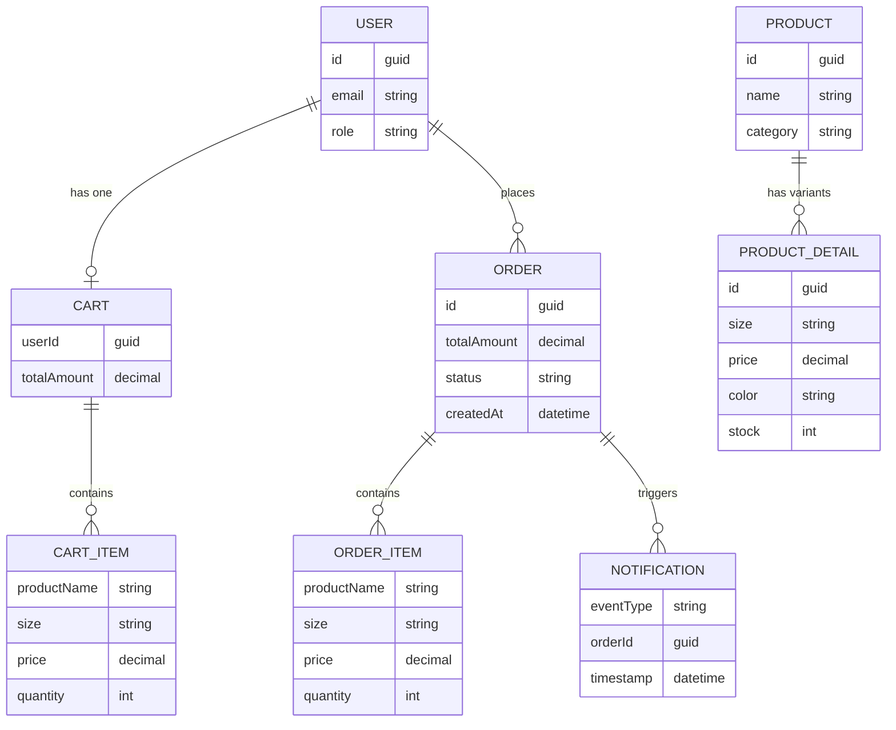
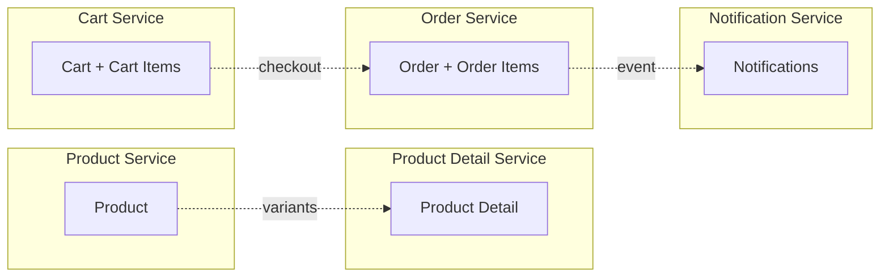

# ER Diagram - Ecommerce Microservices

> How our data is organized across all services.

---

## Data Model Overview

---

## Which Service Owns What?

---

## Simple Relationship Summary

| Entity | Connects To | How? |
|--------|-------------|------|
| **Product** | Product Detail | 1 product has many variants (sizes, colors) |
| **User** | Cart | 1 user has 1 cart |
| **Cart** | Cart Items | 1 cart has many items |
| **User** | Orders | 1 user can place many orders |
| **Order** | Order Items | 1 order has many items |
| **Order** | Notification | 1 order triggers notifications |

---

## Recommended Databases (for production)

| Service | Best Database | Why? |
|---------|--------------|------|
| Product Service | PostgreSQL | Structured data, filtering |
| Product Detail Service | PostgreSQL | Variant data, joins |
| Cart Service | Redis | Fast, temporary data |
| Order Service | PostgreSQL | Transactions, audit trail |
| Notification Service | MongoDB | Flexible event logs |
