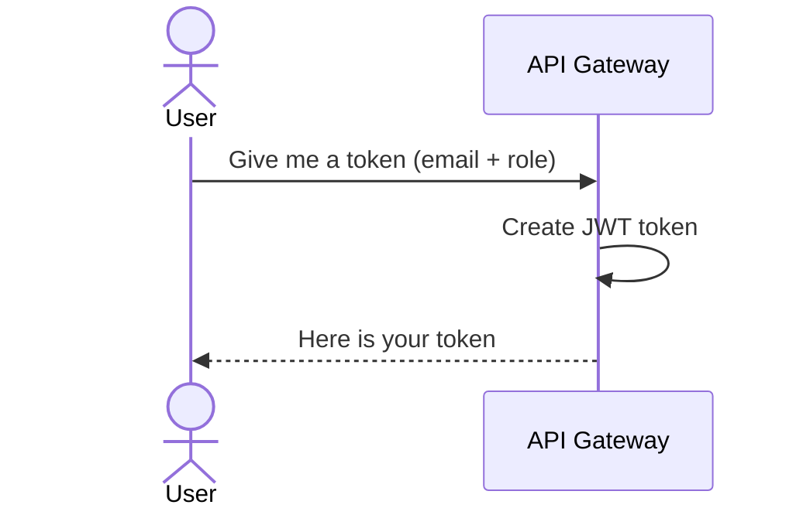
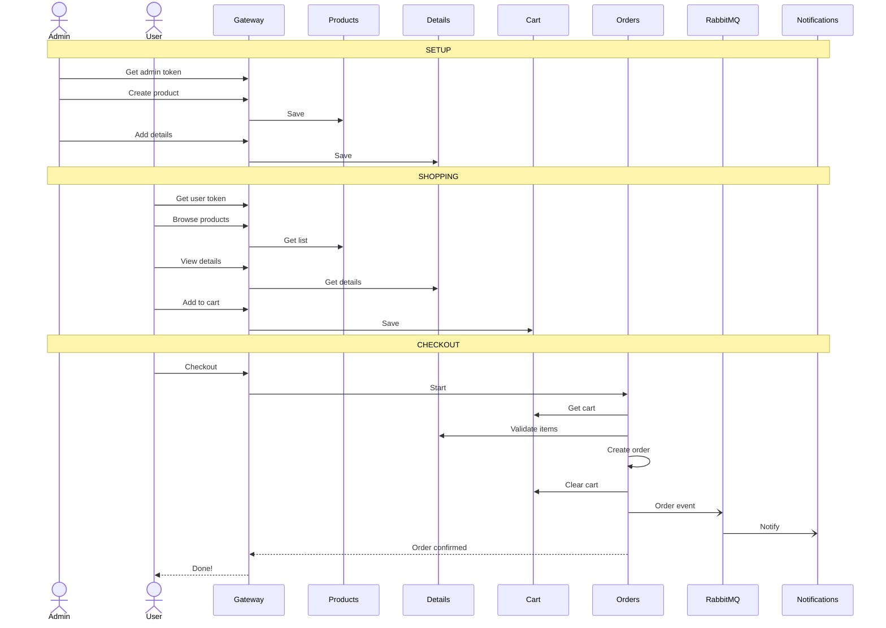
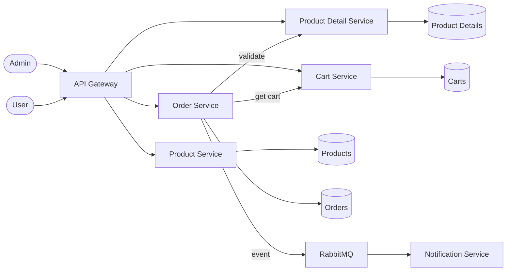

# Sequence Diagrams - Ecommerce Microservices

> Step-by-step flows showing how services communicate.

---

## 1. Login (Get Token)



> Use this token in all future requests.

---

## 2. Admin Sets Up Products

```mermaid
sequenceDiagram
    actor Admin
    participant Gateway as API Gateway
    participant Products as Product Service
    participant Details as Product Detail Service

    Admin->>Gateway: Create a new product
    Gateway->>Products: Save product
    Products-->>Gateway: Product created
    Gateway-->>Admin: Done! Here is the product ID

    Admin->>Gateway: Add size/color/price details
    Gateway->>Details: Save product details
    Details-->>Gateway: Details saved
    Gateway-->>Admin: Done!
```

---

## 3. User Browses & Adds to Cart

```mermaid
sequenceDiagram
    actor User
    participant Gateway as API Gateway
    participant Products as Product Service
    participant Details as Product Detail Service
    participant Cart as Cart Service

    User->>Gateway: Show me all products
    Gateway->>Products: Get product list
    Products-->>Gateway: Product list
    Gateway-->>User: Here are the products

    User->>Gateway: Show me sizes/prices for this product
    Gateway->>Details: Get details
    Details-->>Gateway: Size, price, color info
    Gateway-->>User: Here are the options

    User->>Gateway: Add this item to my cart
    Gateway->>Cart: Add item
    Cart-->>Gateway: Cart updated
    Gateway-->>User: Item added to cart!
```

---

## 4. Checkout (The Main Flow)

```mermaid
sequenceDiagram
    actor User
    participant Gateway as API Gateway
    participant Orders as Order Service
    participant Cart as Cart Service
    participant Details as Product Detail Service
    participant RabbitMQ as RabbitMQ
    participant Notify as Notification Service

    User->>Gateway: Checkout my cart!
    Gateway->>Orders: Start checkout

    Note over Orders: Step 1: Get the cart
    Orders->>Cart: What is in the cart?
    Cart-->>Orders: Cart items

    Note over Orders: Step 2: Verify items exist
    Orders->>Details: Are these items still available?
    Details-->>Orders: Yes, all good

    Note over Orders: Step 3: Create the order
    Orders->>Orders: Save order (Status: Confirmed)

    Note over Orders: Step 4: Empty the cart
    Orders->>Cart: Clear the cart
    Cart-->>Orders: Cart cleared

    Note over Orders: Step 5: Send notification
    Orders-)RabbitMQ: Order created event
    RabbitMQ-)Notify: Deliver event
    Notify->>Notify: Log notification

    Orders-->>Gateway: Order confirmed!
    Gateway-->>User: Your order is placed!
```

---

## 5. Checkout Fails (Item Unavailable)

```mermaid
sequenceDiagram
    actor User
    participant Gateway as API Gateway
    participant Orders as Order Service
    participant Cart as Cart Service
    participant Details as Product Detail Service
    participant RabbitMQ as RabbitMQ
    participant Notify as Notification Service

    User->>Gateway: Checkout my cart!
    Gateway->>Orders: Start checkout

    Orders->>Cart: What is in the cart?
    Cart-->>Orders: Cart items

    Orders->>Details: Are these items still available?
    Details-->>Orders: Item not found!

    Orders-)RabbitMQ: Order failed event
    RabbitMQ-)Notify: Deliver event
    Notify->>Notify: Log failure

    Orders-->>Gateway: Checkout failed
    Gateway-->>User: Sorry, item is no longer available

    Note over User,Notify: Cart is NOT cleared — user can fix and retry
```

---

## 6. Full End-to-End Flow



---

## Data Flow Overview (DFD)



---

## Communication Summary

| From | To | Type | How |
|------|----|------|-----|
| Client | Gateway | Sync | HTTP REST |
| Gateway | Any Service | Sync | HTTP REST |
| Order Service | Cart Service | Sync | HTTP call |
| Order Service | Detail Service | Sync | HTTP call |
| Order Service | Notification Service | **Async** | **RabbitMQ** |
