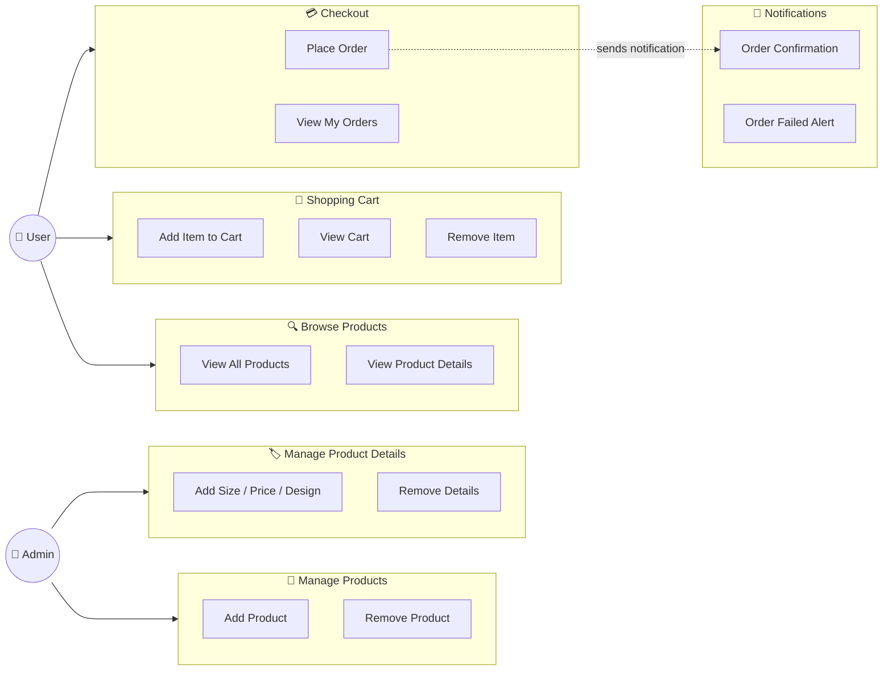

# Use Case Diagram

## Who can do what?

> **Admin** = manages the store (add/remove products and their details)
>
> **User** = shops (browse, cart, checkout)
>
> Both Admin and User need to **login first** to get a token

---

## Simple Summary

| Who? | What can they do? | Needs Login? |
|------|-------------------|:------------:|
| Admin | Add / Remove products | Yes |
| Admin | Add / Remove product details (size, price, design) | Yes |
| Anyone | View all products & details | No |
| User | Add items to cart, view cart, remove items | Yes |
| User | Place an order (checkout) | Yes |
| User | View past orders | Yes |
| System | Send order notifications automatically | — |
